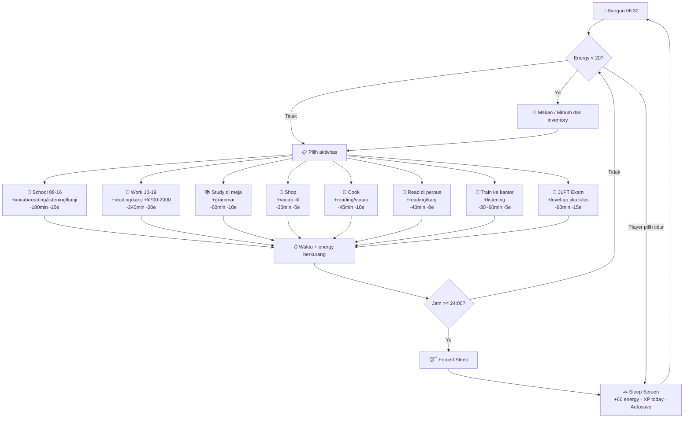

# 🎮 GDD Reverse-Engineered — Nihon Life: Live, Learn, Work

> **Dokumen ini dibuat secara otomatis dengan memindai seluruh codebase (`src/`).**
> Tanggal reverse-engineer: 2026-07-14
> Status project: Pre-Alpha (core loop berfungsi, beberapa sistem butuh penyempurnaan)

---

## 1. CORE SYSTEM & ARCHITECTURE (SISTEM INTI)

### 1.1 File-File Utama

| Layer | File | Peran |
|-------|------|-------|
| **State** | `src/game/state/gameState.ts` | Zustand store — seluruh state game (waktu, uang, energi, skill, inventory, quest) |
| **Types** | `src/core/types.ts` | TypeScript definitions: `SaveData`, `SkillId`, `JlptLevel`, `Season`, `ItemDef`, `NpcDef`, `QuestDef`, dll |
| **Events** | `src/game/events.ts` | Typed event bus (`Bus`) — komunikasi antar scene via `"time"`, `"money"`, `"xp"`, `"quest-event"`, `"toast"`, dll |
| **Time** | `gameState.ts` (actions: `advanceMinutes`, `sleep`) | Engine waktu & siklus hari |
| **Energy** | `gameState.ts` (actions: `addEnergy`) | Sistem stamina karakter (0–100) |
| **Money** | `gameState.ts` (actions: `addMoney`, `spendMoney`) | Sistem ekonomi (¥) |
| **Inventory** | `gameState.ts` (actions: `addItem`, `removeItem`, `eatItem`) | Inventory `Record<string, number>` berbasis item ID |
| **Skills/XP** | `gameState.ts` (actions: `addXp`, `totalXp`, `examReady`, `passExam`) | 5 skill + JLPT level-up |
| **Quests** | `src/game/systems/quests.ts` + `src/data/quests.ts` | Engine quest + definisi quest |
| **Save/Load** | `src/core/db.ts` (Dexie/IndexedDB) + `src/game/systems/save.ts` | Persistensi data game |
| **NPC** | `src/data/npcs.ts` + `UIScene.ts` (talk/gift) | NPC definitions, schedule, dialogue, friendship |
| **Items** | `src/data/items.ts` | 36 item definitions + shop stock |
| **Maps** | `src/game/maps/maps.ts` + Tiled JSON di `/public/maps/` | 9 lokasi (town, apartment, school, station, konbini, supermarket, company, restaurant, library) |
| **Game Config** | `src/game/index.ts` | Phaser config (960×540, FIT scaling, non-pixelArt rendering) |
| **i18n** | `src/game/i18n.ts` | UI language (ja/en/ja-en), meaning language (idn/en), show kana/meaning toggle |

### 1.2 Mekanisme Sistem Waktu (Time Engine)

```
KONVERSI: 1 detik real-time = 2 menit in-game
          1 hari in-game  = 12 menit real-time (jika terus berjalan)
```

| Konstanta | Nilai | Keterangan |
|-----------|-------|------------|
| `DAY_START` | 390 menit (06:30) | Hari dimulai pukul 06:30 |
| `DAY_END` | 1440 menit (24:00) | Tengah malam = forced sleep |
| `MAX_ENERGY` | 100 | Energi maksimum |

**Alur waktu:**
1. Waktu berjalan otomatis di `MapScene.update()` — setiap 1 detik real = +2 menit via `G().advanceMinutes(2)`
2. Aktivitas menambah waktu: `G().advanceMinutes(timeCost)` saat selesai
3. Saat `minutes >= DAY_END` → scene `Sleep` auto-launch dengan `forced: true`
4. `sleep()` → reset jam ke `DAY_START (06:30)`, increment `day`, reset `activitiesDone[]`, recalculate season & weather

**Musim (Season):**
- Setiap musim = 28 hari. Siklus penuh = 112 hari
- `(day - 1) % 112 / 28` → spring (hari 1–28), summer (29–56), autumn (57–84), winter (85–112)

**Cuaca (Weather):**
- Di-roll tiap pagi via `rollWeather(season)`
- Winter: 20% snow
- Non-winter: ~22% rain, ~28% cloudy, ~50% sunny

### 1.3 Kebutuhan Dasar Karakter (Needs/Attributes)

Hanya ada **satu atribut kebutuhan**: **Energy** (0–100).

| Atribut | Range | Decay Rate | Recovery |
|---------|-------|------------|----------|
| **Energy** | 0–100 | Via aktivitas: −5 s/d −20 per aksi | Makan: +5 s/d +60 per item; Tidur normal: +100; Tidur paksa: +60 |

**TIDAK ada sistem:** hunger, thirst, hygiene, social, atau happiness. Game hanya memiliki 1 dimensi kebutuhan.

**Catatan penting:** Tidak ada hukuman jika energy mencapai 0. Tidak ada "pingsan" di tengah hari (forced sleep hanya terjadi di tengah malam). Player bisa tetap jalan-jalan dengan energy 0.

---

## 2. GAMEPLAY LOOP & ACTIONS

### 2.1 Daftar Aktivitas

| # | Aktivitas | Lokasi | Time (min) | Energy | Repeatable? |
|---|-----------|--------|------------|--------|-------------|
| 1 | **Study** (belajar grammar) | Meja apartemen | 60 | −10 | ❌ 1×/hari |
| 2 | **School** (kelas bahasa) | Sekolah (08–16) | 180 | −15 | ❌ 1×/hari |
| 3 | **Work** (kerja IT) | Kantor (10–19) | 240 | −20 | ❌ 1×/hari |
| 4 | **Shop** (belanja) | Konbini/Supermarket/Vending/Restaurant | 30 | −5 | ✅ Bebas |
| 5 | **Cook** (masak) | Dapur apartemen | 45 | −10 | ✅ Bebas |
| 6 | **Read** (baca di perpus) | Perpustakaan | 40 | −8 | ✅ Bebas |
| 7 | **Train** (naik kereta) | Stasiun | 30–60 | −5 | ✅ Bebas |
| 8 | **Sleep** (tidur) | Tempat tidur | Ke hari berikutnya | +100 / +60 | 1×/hari (malam) |
| 9 | **Exam** (ujian JLPT) | Perpustakaan | 90 | −15 | ❌ 1×/hari (jika gagal) |
| 10 | **Story** (cerita AI) | Meja apartemen | 30 | −5 | ✅ Bebas |
| 11 | **Talk/Gift NPC** | Tergantung NPC | 0 | 0 | Talk: 1×/hari/NPC; Gift: 1×/hari/NPC |

### 2.2 Efek Aktivitas terhadap Status

#### XP Rewards per Skill

| Aktivitas | Grammar | Vocab | Reading | Listening | Kanji | Money |
|-----------|---------|-------|---------|-----------|-------|-------|
| **Study** | 10 + (score×5) | — | — | — | — | — |
| **School** | — | 4–12 | 4–10 | 4–10 | 3 | — |
| **Work** | — | 4 | 6–14 | — | 4–8 | +¥700–2000 |
| **Shop** | — | 0–16 | 0–4 | — | — | −cost |
| **Cook** | — | 5 | 5–10 | — | — | — |
| **Read** | — | — | 3–8 | — | 2–8 | — |
| **Train** | — | — | 5 | 3–8 | 4 | — |
| **Exam** | 0–5* | — | — | — | — | — |
| **Story** | (dinamis) | (dinamis) | (dinamis) | (dinamis) | (dinamis) | (dinamis) |

> \* Exam: grammar XP hanya diberikan saat **gagal** (konsolasi 5 XP). Tidak ada reward XP saat lulus.

### 2.3 Daily Reset (Tidur)

Setiap tidur, yang di-reset:
- `activitiesDone[]` → dikosongkan (semua aktivitas bisa dilakukan lagi)
- `npcs[*].talkedToday` → false
- `npcs[*].giftedToday` → false
- `flags.xpToday` → 0
- Energy → 100 (normal) atau 60 (forced)
- Daily quest di-roll ulang

---

## 3. IN-GAME ECONOMY (EKONOMI GAME)

### 3.1 Starting Economy

| Item | Nilai |
|------|-------|
| Uang awal | **¥3,000** |
| Inventory awal | `bread` (×1), `greentea` (×1) |
| Energy awal | 100 |

### 3.2 Sumber Pendapatan

| Sumber | Estimasi Income | Frekuensi |
|--------|-----------------|-----------|
| **Work (shift IT)** | ¥700–2,000 | 1×/hari |
| **Main Quest** (3 quest) | ¥500 + ¥500 + ¥1,000 | One-time |
| **Daily Quest** | ¥150–200 | 1×/hari |
| **Story (AI reward)** | Bervariasi (dinamis) | Jika API aktif |

**Work detail:** 2 tiket kerja per shift. Tiap tiket punya `pay` (¥700–1000). Jika perfect → full pay. Jika salah → `round(pay / 2)`.

### 3.3 Pengeluaran

| Kategori | Range Harga |
|----------|-------------|
| Bahan masak (ingredients) | ¥60 – ¥400 |
| Makanan siap saji | ¥110 – ¥480 |
| Minuman | ¥110 – ¥130 |
| Hadiah (gifts) | ¥160 – ¥500 |
| Buku (books) | ¥900 – ¥1,200 |
| Jimat (omamori) | ¥400 |

### 3.4 Analisis Ekonomi

```
Pendapatan harian maksimal:   ~¥2,000 (work) + ¥200 (daily quest) = ~¥2,200
Pengeluaran makan 1×/hari:     ~¥110–480 (makanan siap saji dari konbini)
Biaya masak (semua bahan):     ~¥1,100–1,400 (untuk 1 resep lengkap)

Kesimpulan: Ekonomi cukup longgar. Player bisa menabung dengan cepat karena
biaya hidup rendah dan hanya ada 1 kebutuhan (makan untuk energy).
```

---

## 4. PROGRESSION & STATS

### 4.1 Skill System

**5 Skill (semua start dari 0):**

| Skill | Cara Naik |
|-------|-----------|
| `grammar` | Study, Exam (gagal), Quest |
| `vocabulary` | School, Shop, Work, Cook, Quest |
| `reading` | School, Work, Cook, Read, Train, Quest |
| `listening` | School, Train, Quest |
| `kanji` | School, Work, Read, Train, Quest |

### 4.2 JLPT Level-Up System

```
N5 (start) ──[300 total XP]──▶ N4 ──[700 total XP]──▶ N3 ──[1400 total XP]──▶ N2/N1 (locked)
```

- **Unlock exam:** Ketika `totalXp() >= LEVEL_XP[currentLevel]`, toast muncul: "JLPT exam unlocked!"
- **Ujian:** 6 soal (2 grammar fill, 3 vocabulary, 1 reading). Harus benar ≥ 4/6.
- **Pass:** Level naik, emit event `"leveled-up"`
- **Fail:** Tidak bisa ujian lagi hari itu. Konsolasi: +5 grammar XP.

### 4.3 Quest System

**Tipe Quest:** `main`, `daily`, `side`, `school`, `work`, `cooking`, `relationship`, `festival`, `story`

| Quest ID | Tipe | Trigger | Reward |
|----------|------|---------|--------|
| `main-1` | main | Auto-start (hari 1) — study + school | ¥500, grammar+10 |
| `main-2` | main | Setelah main-1 — shop + cook | ¥500, vocab+10 |
| `main-3` | main | Setelah main-2 — train + work | ¥1,000, reading+10, kanji+5 |
| `side-yuki-1` | relationship | Friendship Yuki ≥ 3 | friendship+2, listening+10 |
| Daily (×3 rotasi) | daily | Roll tiap pagi | ¥150–200 + 5 XP |

**Event tracking:** Quest objective mendengarkan `Bus` event: `"talk"`, `"gift"`, `"buy"`, `"cook"`, `"eat"`, `"activity"`, dll. Progress otomatis bertambah saat event terjadi.

### 4.4 Friendship System

**4 NPC:**
- **Tanaka-sensei** — Guru di sekolah
- **Yuki** — Teman sekelas (punya relationship quest)
- **Yamada-san** — Rekan kerja di kantor
- **Sato-san** — Pegawai konbini

**Friendship range:** 0–10

| Aksi | Δ Friendship |
|------|--------------|
| Ngobrol pertama kali/hari | +1 |
| Kasih hadiah biasa | +1 |
| Kasih hadiah favorit | +2 |
| Quest reward | Bervariasi |

**Milestone:** Friendship ≥ 3 + NPC punya `questId` → relationship quest auto-start.

---

## 5. ALUR & REKOMENDASI (GAMEPLAY FLOW ANALYSIS)

### 5.1 Core Loop — Flowchart (Mermaid)



### 5.2 Analisis Logika — Masalah & Loophole

#### 🔴 CRITICAL: Tidak ada hukuman energy = 0

Player bisa berjalan dengan energy 0 tanpa konsekuensi. Tidak bisa melakukan aktivitas yang punya energy gate (study/school/work/read), tapi tetap bisa shop, cook, train, dan jalan-jalan. Forced sleep hanya trigger di tengah malam.

**Dampak:** Player bisa "soft-lock" di siang hari tanpa energy dan tanpa uang untuk beli makanan. Satu-satunya jalan keluar: menunggu waktu nyata ~6 menit sampai tengah malam.

#### 🟡 MAJOR: Exam tidak memberi XP saat lulus

`ExamScene.ts` memberi 5 grammar XP hanya saat **gagal**. Saat lulus: 0 XP. Ini berlawanan dengan intuisi — player yang berhasil lulus ujian JLPT tidak mendapat XP sama sekali.

#### 🟡 MAJOR: Read activity tidak bisa di-mark daily

`ReadScene` tidak memanggil `markActivity()`. Artinya: Read tidak tercatat di `activitiesDone[]`, bisa dilakukan berkali-kali tanpa batas daily selain energy. Ini bisa jadi bug atau fitur — tapi tidak konsisten dengan aktivitas lain.

**Dampak:** Player bisa grinding reading+kanji XP tanpa batas dengan modal makanan murah.

#### 🟡 MAJOR: Ekonomi terlalu mudah

Dengan work shift ¥700–2,000/hari dan biaya makan ¥110–480, player bisa mengakumulasi uang sangat cepat. Tidak ada sistem sewa apartemen, tagihan, atau pengeluaran berkala.

#### 🟠 MEDIUM: Tidak ada pembatas waktu tidur

Player bisa tidur kapan saja (pagi, siang, sore) tanpa penalti. Tidak ada sistem "kamu hanya bisa tidur setelah jam 20:00". Tidur pukul 07:00 menghasilkan hari baru.

**Dampak:** Player bisa skip hari dengan cepat tanpa melakukan apa-apa — cukup spam tidur.

#### 🟠 MEDIUM: Vending machine & Restaurant langsung consume item

Di vending dan restaurant, item langsung terpakai (`buyInstant`). Player tidak bisa menyimpan minuman dari vending ke inventory. Tidak ada opsi "beli untuk nanti".

#### 🟠 MEDIUM: Story scene dependensi API eksternal

`StoryScene` bergantung pada `GROQ_API_KEY` atau `GEMINI_API_KEY` di server. Tanpa API key, fitur ini tidak berfungsi. Tidak ada fallback cerita offline.

#### 🟡 LOW: Train selalu mengarah ke company

Train selalu memindahkan player ke `"company"`. Tidak ada rute alternatif ke stasiun lain — padahal ada 6 stasiun dalam data.

### 5.3 Rekomendasi Perbaikan

#### Fase 1 — Stabilisasi (PRIORITAS)

| # | Rekomendasi | Dampak |
|---|-------------|--------|
| 1 | **Tambahkan forced sleep saat energy = 0** | Cegah soft-lock. Player collapses dan tidur paksa seperti di tengah malam |
| 2 | **Beri XP reward saat lulus exam** | Logika reward/punishment jadi konsisten. Misal: +20 grammar, +10 reading saat lulus |
| 3 | **Beri penalti energy 0** | Tidak bisa belanja/cook/train saat energy 0. Atau movement speed dikurangi |
| 4 | **Batasi jam tidur** | Hanya bisa tidur mulai jam 20:00 (atau 21:00) — cegah day-skipping exploit |

#### Fase 2 — Balancing

| # | Rekomendasi | Dampak |
|---|-------------|--------|
| 5 | **Tambahkan pengeluaran rutin** | Sewa apartemen ¥500/minggu, atau biaya makan otomatis ¥100/hari. Bikin uang terasa berharga |
| 6 | **Turunkan work pay atau tambah variasi** | Pay ¥350–1000 per tiket, atau tambah sistem performa (3 tingkat: perfect/good/bad) |
| 7 | **Read activity: tambahkan daily limit** | Panggil `markActivity("reading")` agar konsisten dengan aktivitas lain |
| 8 | **Vending & Restaurant: tambah opsi "beli untuk nanti"** | Biarkan player memilih: langsung makan/minum atau simpan di inventory |
| 9 | **Train multi-rute** | Bisa pilih destinasi: company, school, town, dll. Membuka gameplay eksplorasi |

#### Fase 3 — Kedalaman Gameplay

| # | Rekomendasi | Dampak |
|---|-------------|--------|
| 10 | **Tambahkan kebutuhan kedua: Social/Mood** | Buat dimensi baru yang turun tiap hari dan naik dengan ngobrol/shopping/hadiah |
| 11 | **Sistem mingguan: Hari libur & event spesial** | Tidak ada kerja/sekolah di weekend. Event festival musiman |
| 12 | **Unlock N2 & N1 exam content** | Sudah ada slot di type system, tinggal isi soal ujian |
| 13 | **Tambahkan lebih banyak NPC & quest side** | Saat ini hanya 4 NPC dan 1 side quest. Sangat sedikit untuk life sim |
| 14 | **Tambahkan random encounter di jalan** | Ketika berjalan di town, kadang ketemu NPC random dengan event kecil |

### 5.4 Arsitektur yang Perlu Diperhatikan

| Komponen | Status | Catatan |
|----------|--------|---------|
| Save/Load (IndexedDB) | ✅ Berfungsi | Auto-save tiap malam |
| UI HUD | ✅ Berfungsi | Jam, uang, energy bar, quest tracker, weather icon |
| Dialogue System | ✅ Berfungsi | Typewriter, choices, kana/meaning toggle |
| Shop System | ✅ Berfungsi | 4 tipe toko, cart-based + instant |
| Cook System | ✅ Berfungsi | 3 resep, step-ordering game |
| Train System | ⚠️ Parsial | Hanya 1 rute, selalu ke company |
| Quest Engine | ✅ Berfungsi | Event-driven, auto-progress |
| AI Story | ⚠️ Bergantung API | Perlu GROQ/GEMINI key; tidak ada fallback offline |
| Content Pipeline | ✅ Berfungsi | Postgres + IndexedDB cache untuk custom content packs |
| i18n (3 bahasa) | ✅ Berfungsi | UI: ja/en/ja-en; Meaning: idn/en; Kana: on/off |
| Exam System | ⚠️ Bug reward | N2/N1 belum tersedia |
| NPC Schedule | ✅ Berfungsi | NPC muncul/pulang sesuai jam |

---

## Appendix: Ringkasan Angka Penting

```
ENERGY
  Max:              100
  Normal Sleep:      +100 (ke max)
  Forced Sleep:      +60
  Work cost:         −20
  School cost:       −15
  Exam cost:         −15
  Study cost:        −10
  Cook cost:         −10
  Read cost:         −8
  Shop cost:         −5
  Train cost:        −5
  Story cost:        −5

WAKTU
  1 real sec = 2 game min
  1 game day = 720 game min (06:30–24:00) = ~12 real min
  Work duration:     240 min (4 jam)
  School duration:   180 min (3 jam)
  Exam duration:     90 min
  Study duration:    60 min
  Cook duration:     45 min
  Read duration:     40 min
  Shop duration:     30 min
  Train duration:    30–60 min
  Story duration:    30 min

JLPT
  N5→N4: 300 total XP
  N4→N3: 700 total XP
  N3→N2: 1,400 total XP (locked)
  Exam: 6 soal, pass ≥ 4 benar

MONEY
  Start:             ¥3,000
  Max daily income:  ~¥2,200
  Min daily food:    ¥110 (coffee) / ¥480 (bento)
  Min ingredients:   ¥60 (greenonion)
  Max ingredient:    ¥400 (meat)
```

---

*Dokumen ini digenerate oleh CommandCode berdasarkan pemindaian otomatis seluruh source code di `D:\Projects\nihon-life-game\src\`.*
